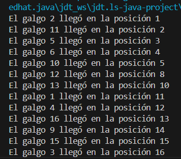

# ARSW-Lab2-ConcurrentProgDogsRaceMaster

## Hecho por: **Alejandro Prieto Reyes**

---

# Parte 1

## Revise el programa “primos concurrentes” (en la carpeta parte1), dispuesto en el paquete edu.eci.arsw.primefinder. Este es un programa que calcula los números primos entre dos intervalos, distribuyendo la búsqueda de los mismos entre hilos independientes. Por ahora, tiene un único hilo de ejecución que busca los primos entre 0 y 30.000.000. Ejecútelo, abra el administrador de procesos del sistema operativo, y verifique cuantos núcleos son usados por el mismo.

**Antes de ejecutar**

**En ejecución**

**Solución:**
Podemos ver que aumenta el uso de núcleos del procesador, de 0 a 10 núcleos con uso alto.

---

## Modifique el programa para que, en lugar de resolver el problema con un solo hilo, lo haga con tres, donde cada uno de éstos hará la tarcera parte del problema original. Verifique nuevamente el funcionamiento, y nuevamente revise el uso de los núcleos del equipo.

**Código para resolver con 3 Threads**

**Antes de ejecutar**

**En ejecución**

**Solución:**
Se usaron los mismos núcleos, misma cantidad, pero se ve un esfuerzo menor en estos.

---

## Lo que se le ha pedido es: debe modificar la aplicación de manera que cuando hayan transcurrido 5 segundos desde que se inició la ejecución, se detengan todos los hilos y se muestre el número de primos encontrados hasta el momento. Luego, se debe esperar a que el usuario presione ENTER para reanudar la ejecución de los mismo.

**Código de la app cumpliendo requerimientos**

**Evidencias 5s**

**Solución:**
La aplicación frena a los 5 segundos y muestra la cantidad de primos encontrados.

---

# Parte 2

## Corrija la aplicación para que el aviso de resultados se muestre sólo cuando la ejecución de todos los hilos ‘galgo’ haya finalizado.

**Código del 'join' de los Galgos**

---

## Una vez corregido el problema inicial, corra la aplicación varias veces, e identifique las inconsistencias en los resultados de las mismas viendo el ‘ranking’ mostrado en consola (algunas veces podrían salir resultados válidos, pero en otros se pueden presentar dichas inconsistencias). A partir de esto, identifique las regiones críticas () del programa.

**Dos galgos en la misma posición de llegada**

**Registro llegada en CMD**

**Región crítica identificada**

---

## Utilice un mecanismo de sincronización para garantizar que a dichas regiones críticas sólo acceda un hilo a la vez. Verifique los resultados.

**Arreglo con synchronized**

**Resultados corregidos**

**Observación:**
No se repite la posición de llegada de ningún galgo.

---

## Implemente las funcionalidades de pausa y continuar. Con estas, cuando se haga clic en ‘Stop’, todos los hilos de los galgos deberían dormirse, y cuando se haga clic en ‘Continue’ los mismos deberían despertarse y continuar con la carrera. Diseñe una solución que permita hacer esto utilizando los mecanismos de sincronización con las primitivas de los Locks provistos por el lenguaje (wait y notifyAll).

**Código que usa wait y notifyAll**

**Explicación:**

* `wait()` se usa para que los hilos de galgos se bloqueen cuando se presiona "Stop".
* `notifyAll()` se usa para reactivar todos los hilos simultáneamente al presionar "Continue".
